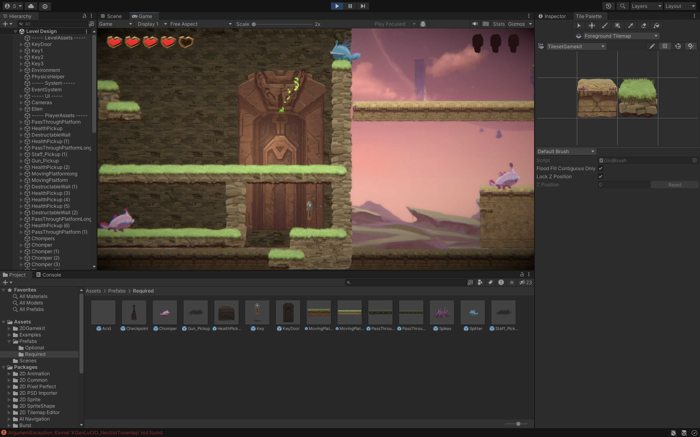
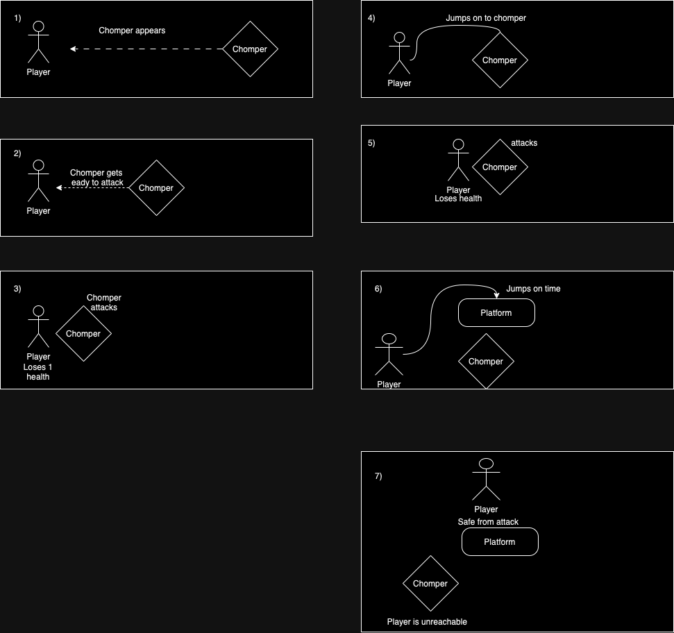
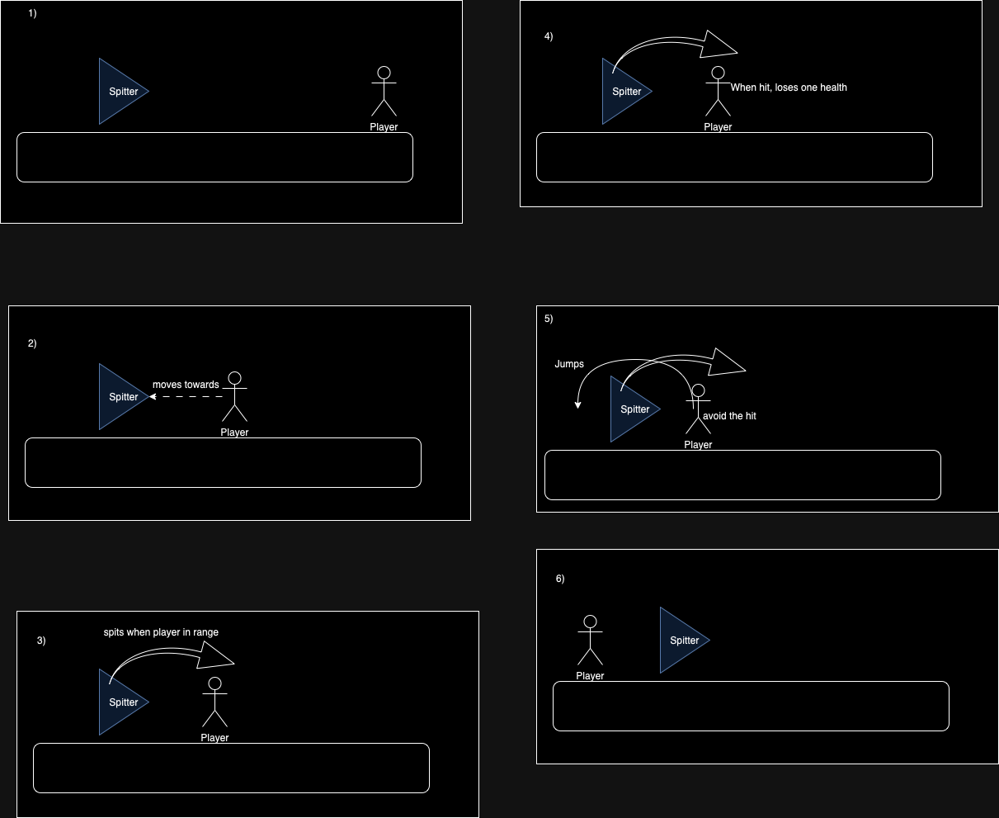
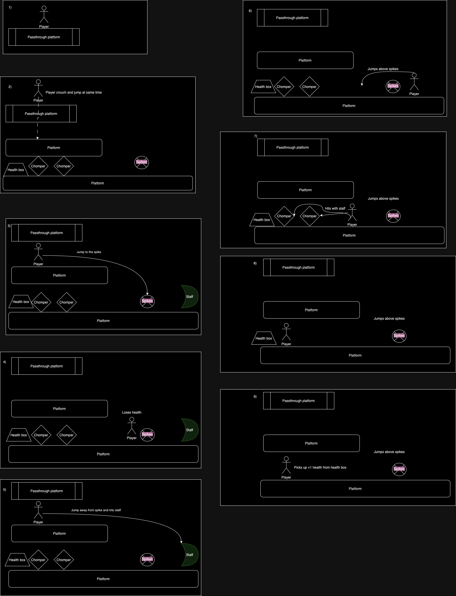
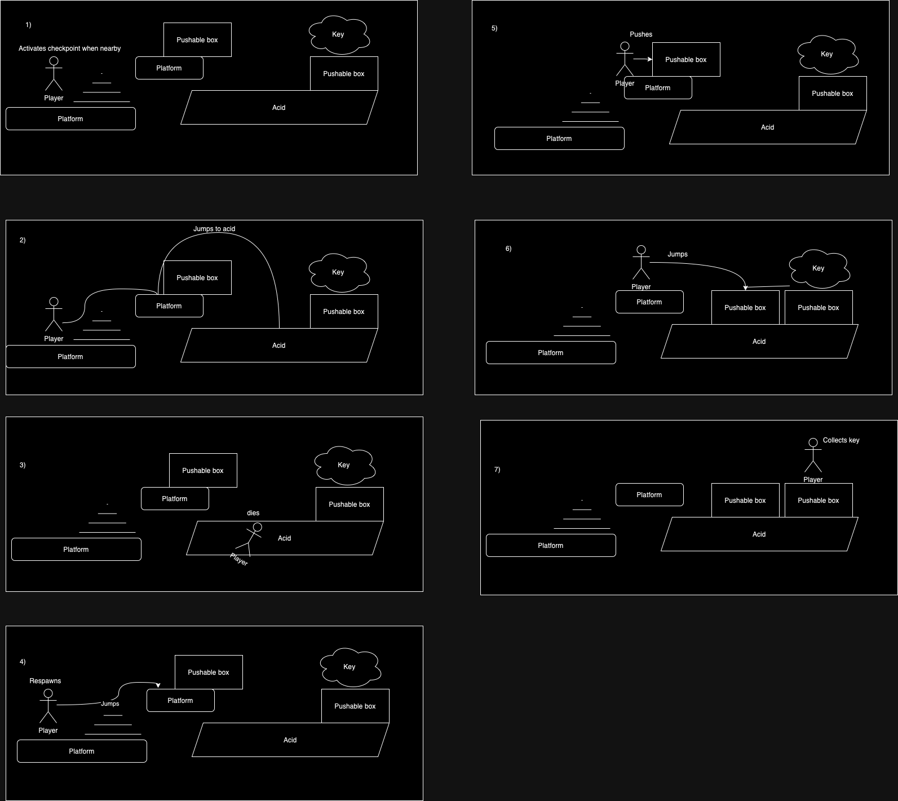
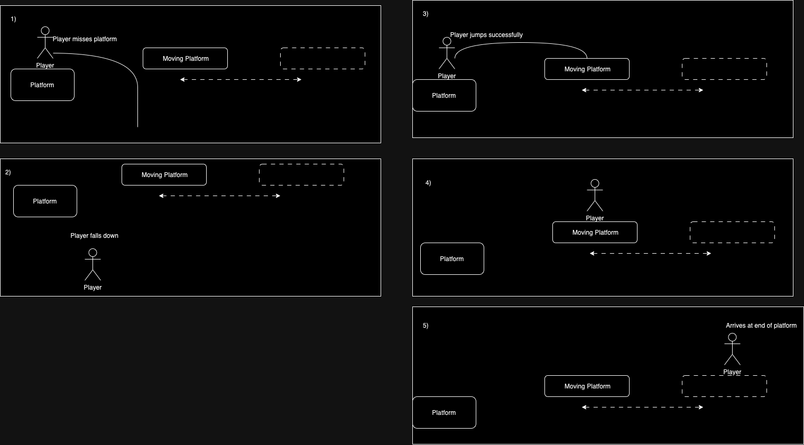
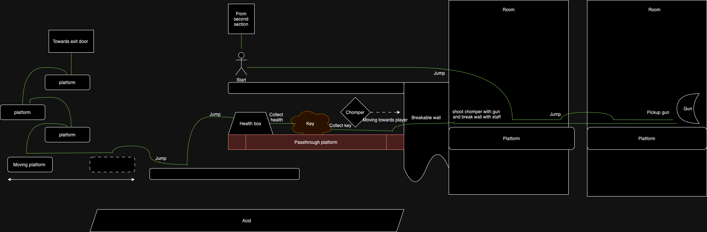
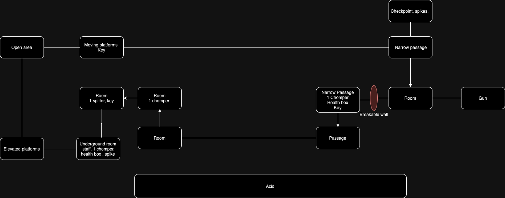

# COMP2150  - Level Design Document
### Name: [Pramod_Sinhala_Pedige]
### Student number: [47849762] 

## 1. Player Experience (~700 words)

### 1.1. Discovery
The game includes many mechanics which the player requires to learn in order to progress.The initial discovery the player may make, are the movement and close range enemy known as ‘chomper’ as well as how to avoid the said enemy. After successfully evading ‘chomper’, player then presented with a long range enemy known as a ‘spitter’ which does damage over projectiles which the player discovers to avoid and get out of the enemy range of attack. After these discoveries, player is presented with a passthrough platform which requires the player to combine various forms of movement combinations to discover how to go to the below level while also being attacked by a ‘spitter’.If a player in reckless, they will discover that ’spikes’ will pose an danger to their adventure.In addition to these discoveries, players are expected to understand spikes,acid, checkpoints, pushable boxes, breakable walls, health boxes, weapons of staff and gun. Players are moderately under pressure to discover the world so that they wont be bored or overwhelmed during the play.

### 1.2. Drama
At the beginnig of the level, player is presented with an imminent danger of a ‘chomper’ which forces the player to take swift action to avoid the danger. Once they have avoided the 1st danger, the intense pressure gets reduced and allows them to figure out which way to go in order to progress the game. The difficulty of the game is high till the player acquires any of the weapons. After obtaining a weapon, difficulty of the game drops down and gradually increases. Intensity of the game is at medium when the player is required to pass through acid, as any contact with this danger causes immediate death and minor progression lost.The dramatic intensity is at its highest when the play has to defeat many enemies at once during the encounter of collecting the 2nd key. After they have defeated the enemies and achieved the key, health points are presented as rewards for their great performance  in their attacks while also allowing the current space as a resting place.

### 1.3. Challenge
The player is presented with the challenge of collecting 3 keys while avoiding the dangers of spitters, chompers, acid, spikes while also navigating through multiple puzzles and mechanics presented in the game in order to progress to the next level. 1st immediate challenge the player is presented with is the rapidly approaching enemy towards them while having no equipment to defend themselves with and finding a escape route as the next approach. If the player does not figure out the controls and what the next step to take, they end up getting defeated by the 1st enemy. The difficulty is brought down for a short period of time until they encounter the next type of enemy. Next challenge is to avoid the long range enemy knows as ‘spitter’ who fires projectiles towards the player. Players new challenge is to avoid those mentioned attacks as they vary depending on where the player moves. Player is given 2 weapons before they have to defeat many enemies at once in order to get the 2nd key

### 1.4. Exploration
The game’s objective is to collect 3 keys in order to open the door and progress to next level. By scattering the keys in 3 different locations, player is encouraged to explore the various paths provided. The first enemy encounter at the beginnig of the game allows the player to quickly explore the surrounding areas for a escape route. Player is allowed to see the final key at the beginnig of the level, so that they understand what they need to do. Since the players path to get that key is blocked by an enemy and a wall, they are encouraged to explore the paths provided to them. They are 3 main sections of the game. 1st area the player is exposed to is the surface level which has more green coloured paths, 2nd area requires the player to explore the air with the use of moving platforms in order to get to the 3rd and last area which is the underground section. Environment is lacking of green colour and more dangers are present in this area

## 2. Core Gameplay (~400 words)

### 2.1. Chompers
First enemy to be introduced in the level because of its inability to attack at long range, thus allowing the player to avoid its attacks.

### 2.2. Spitters
2nd enemy to be introduces as the player would have learned movemnt controls. Slow rate of fire allows the player to move swiftly

### 2.3. Passthrough Platforms
Encouraged the player to find a way to descend to the below level before getting attacked by the enemy

### 2.4. Spikes
Player would rush to get away from enemies, thus making them fall onto the spikes and let them discover its danger

### 2.5. Weapon Pickup (Staff)
Players have to defend themselves against the enemies as they would not be able to progress towards otherwise and collct the key

### 2.6. Health Pickups
As a reward after getting attacked by enemies

### 2.7. Checkpoints
Allows the player to respawn in case they jump into acid and eliminating the need to repeat the level

### 2.8. Acid
to allow the player to experiment pushbale boxes in combination with acid.

### 2.9. Keys
If left alone in the open at the very beginning, the value of it will be diminished 

### 2.10. Moving Platforms
Introduction into a new scenery outside of the rooms and as a new way of travlling.

### 2.10. Weapon Pickup (Gun)

## 3. Spatiotemporal Design

 
### 3.1. Molecule Diagram

### 3.2. Level Map – Section 1

### 3.3.	Level Map – Section 2

### 3.4.	Level Map – Section 3

## 4. Iterative Design (~400 words)
During the initial planning of this game, I failed to sufficiently include variety of game objects which will allow increase the challenge of the game. In retrospective, this deficiency of challenge appears to have resulted in the game too easy and this resulted in lack of proper engagement with the game by the player. 

Furthermore, I discovered that pushable boxes float on acid and this mechanic allowed me to see a possibility of using these boxes as a break from frequent platforms made using tiles. I was faced With the struggle of finding a way to properly implement this ideas as sometimes the player would get hit by the invisible hit box of acid and as a designer, I wasn’t allowed to change any properties. 
Another issue that was prominent was the lack of sufficient quantity of enemies. After performing several play tests, it was evident that the game was in need of a challenge
Furthermore, the 1st key placement in initial development attempts made it too easy for players to obtain, thus diminishing the value of the key. Another challenge during designing of this game was the lack of the required feature of acid and checkpoint. After several play tests, I was able to come up with new ideas on how to incorporate all the required features in the game. 
One of the major doubts I have during the development was the length and difficulty of the game due to lack of peer testing. After finalising the game, I believe the game might have been too long to the inexperienced players, however it was too late to modify the game in a major manner as I’m reaching the required deadline. To elaborate further on the preceding statement, I believe as a result of being exposed to the game frequently, I was able to find the game too easy. As a indie designer of the game, I found it difficult to play test the game as I was a new player to the game which was designed by myself
In the future iteration of developments, I intend to test the game in hands of the target audience, acquire their feedback regarding what aspects of the game felt too difficult, too easy, confusing and finally modify the game according to the feedback received. By doing these testing, I would be able to refine the game to be more engaging to the targeted demographic.

